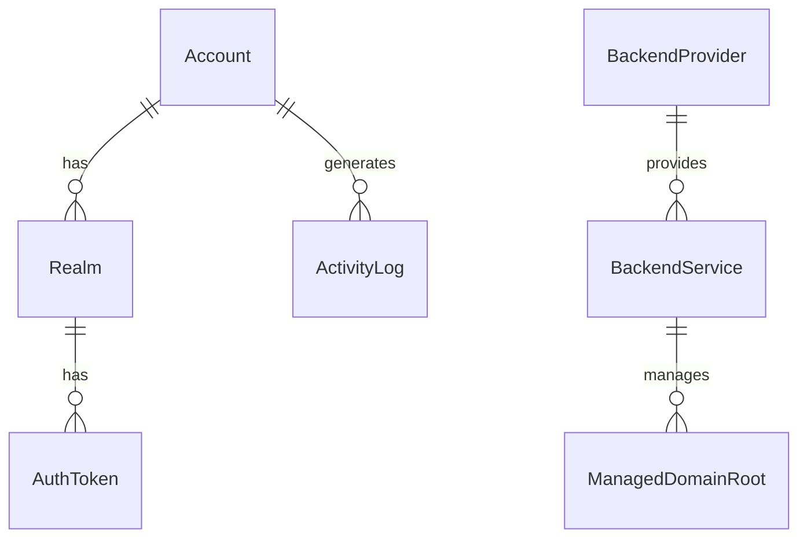

# Deep Dive Review: Database Models & Schema Architecture

## Context

The application uses SQLAlchemy ORM with a comprehensive schema supporting:
- **Multi-backend architecture**: Multiple DNS provider instances (Netcup, PowerDNS)
- **Domain management**: Platform and user-owned DNS zones
- **Account system**: Accounts → Realms → Tokens hierarchy
- **Authorization**: Realm-based permissions with record type/operation filtering
- **Activity logging**: Comprehensive audit trail
- **Settings storage**: JSON configuration in database
- **Enum tables**: Type-safe foreign key relationships

## Review Objective

Verify that the database schema is:
1. **Normalized** - Proper normalization (3NF+), no data duplication
2. **Performant** - Indexes on lookups, efficient queries
3. **Type-safe** - Enums used correctly, constraints enforced
4. **Migration-ready** - Can evolve without breaking changes
5. **Consistent** - Naming conventions, relationships properly defined

## Review Checklist

### 1. Core Models Structure

**Files:** `src/netcup_api_filter/models.py`

#### Account Model
- [ ] **Primary key**: `id` auto-increment integer
- [ ] **Unique constraints**: `username`, `email` unique
- [ ] **Password storage**: `password_hash` field (never plaintext)
- [ ] **Status fields**: `is_approved`, `must_change_password`, `is_active`
- [ ] **2FA support**: `totp_secret`, `totp_enabled_mandatory`
- [ ] **Timestamps**: `created_at`, `updated_at`, `last_login_at`
- [ ] **Relationships**: One-to-many with Realm, ActivityLog, BackendService
- [ ] **Indexes**: On username, email for fast lookups
- [ ] **Nullability**: Correct nullable fields (email can be null initially)

**Test:**
```python
from netcup_api_filter.models import Account, db

# Test unique constraints
account1 = Account(username="test", email="test@test.com", password_hash="hash")
db.session.add(account1)
db.session.commit()

# Should fail (duplicate username)
account2 = Account(username="test", email="other@test.com", password_hash="hash")
db.session.add(account2)
try:
    db.session.commit()
    assert False, "Duplicate username allowed"
except Exception as e:
    db.session.rollback()
    assert "UNIQUE constraint failed" in str(e)
```

#### Realm Model
- [ ] **Foreign keys**:
  - [ ] `account_id` → Account (NOT NULL)
  - [ ] `domain_root_id` → ManagedDomainRoot (nullable - legacy support)
  - [ ] `backend_service_id` → BackendService (nullable - uses domain_root's backend)
- [ ] **Realm fields**: `realm_value`, `realm_type` (host/subdomain/wildcard)
- [ ] **Permission arrays**: `record_types`, `operations` (JSON arrays)
- [ ] **IP filtering**: `allowed_ip_ranges` (JSON array of CIDR strings)
- [ ] **Unique constraint**: `(account_id, realm_value, realm_type)` prevents duplicates
- [ ] **Indexes**: On account_id, realm_value for efficient lookups
- [ ] **Validation**: Realm value format validated (domain syntax)
- [ ] **Relationships**: One-to-many with AuthToken

#### AuthToken Model
- [ ] **Foreign keys**:
  - [ ] `realm_id` → Realm (NOT NULL, CASCADE delete)
- [ ] **Token fields**: `token_prefix`, `token_hash` (bcrypt)
- [ ] **Alias**: `alias` for human-readable identification
- [ ] **Expiration**: `expires_at` (nullable = no expiration)
- [ ] **Status**: `is_active` for soft deletion
- [ ] **Timestamps**: `created_at`, `last_used_at`
- [ ] **Unique constraint**: `token_prefix` unique (for fast lookups)
- [ ] **Index**: On token_prefix (most common lookup)
- [ ] **Cascade**: Deleting realm deletes all its tokens

#### BackendProvider Model (Enum Table)
- [ ] **Code**: `provider_code` unique (e.g., "netcup", "powerdns")
- [ ] **Display name**: Human-readable name
- [ ] **Config schema**: JSON schema for validation
- [ ] **Status**: `is_active`, `is_built_in` flags
- [ ] **Seeded data**: Netcup and PowerDNS providers seeded
- [ ] **Relationships**: One-to-many with BackendService

#### BackendService Model
- [ ] **Foreign key**: `provider_id` → BackendProvider
- [ ] **Service name**: `service_name` unique across system
- [ ] **Owner fields**:
  - [ ] `owner_type` (OwnerTypeEnum: PLATFORM/USER)
  - [ ] `owner_account_id` → Account (nullable if platform-owned)
- [ ] **Config**: `config` JSON blob (provider-specific settings)
- [ ] **Display**: `display_name` for UI
- [ ] **Status**: `is_active` flag
- [ ] **Unique constraint**: `service_name` globally unique
- [ ] **Indexes**: On service_name, owner_account_id
- [ ] **Validation**: Config matches provider schema

#### ManagedDomainRoot Model
- [ ] **Foreign key**: `backend_service_id` → BackendService (NOT NULL)
- [ ] **Domain fields**:
  - [ ] `root_domain` - User-facing domain name
  - [ ] `dns_zone` - Actual zone in DNS backend
- [ ] **Visibility**: `visibility` (VisibilityEnum: PUBLIC/PRIVATE/INVITE)
- [ ] **Subdomain rules**:
  - [ ] `allow_apex_access` - Can users access root domain?
  - [ ] `min_subdomain_depth`, `max_subdomain_depth` - Depth limits
- [ ] **Permissions**:
  - [ ] `allowed_record_types` (JSON array or NULL = all)
  - [ ] `allowed_operations` (JSON array or NULL = all)
- [ ] **Quotas**: `user_quotas` JSON (max_hosts_per_user, etc.)
- [ ] **Settings**: `require_email_verification`
- [ ] **Display**: `display_name`, `description`
- [ ] **Unique constraint**: `(backend_service_id, root_domain)`
- [ ] **Indexes**: On root_domain, backend_service_id

#### ActivityLog Model
- [ ] **Foreign keys** (all nullable):
  - [ ] `account_id` → Account
  - [ ] `realm_id` → Realm
  - [ ] `token_id` → AuthToken
  - [ ] `backend_service_id` → BackendService
- [ ] **Activity fields**:
  - [ ] `activity_type` (login, failed_auth, dns_update, etc.)
  - [ ] `source_ip`, `user_agent`
  - [ ] `status` (success, failure, error)
  - [ ] `error_code`, `status_reason`
- [ ] **Severity**: `severity` (info, warning, error, critical)
- [ ] **Details**: `request_data`, `response_summary` (JSON)
- [ ] **Record context**: `domain`, `record_name`, `record_type`
- [ ] **Timestamp**: `created_at` (UTC)
- [ ] **Indexes**: On created_at, account_id, activity_type
- [ ] **Partitioning**: Consider partitioning for large datasets

#### Settings Model (Key-Value Store)
- [ ] **Fields**: `key` (unique), `value` (JSON string)
- [ ] **Timestamp**: `updated_at`
- [ ] **Helper functions**: `get_setting()`, `set_setting()`, `delete_setting()`
- [ ] **Usage**: Stores app config, email settings, API credentials

### 2. Enum Tables & Type Safety

**Files:** `src/netcup_api_filter/models.py` (Enum definitions)

- [ ] **OwnerTypeEnum**: PLATFORM, USER
- [ ] **VisibilityEnum**: PUBLIC, PRIVATE, INVITE
- [ ] **RealmTypeEnum**: host, subdomain, wildcard (stored as strings, not enum)
- [ ] **Enum consistency**: All enums use same pattern
- [ ] **Database storage**: Stored as strings (VARCHAR) not integers
- [ ] **Migration safety**: New enum values don't break existing data

### 3. Relationships & Cascades

**Relationship diagram verification**

```
Account (1) → (N) Realm → (N) AuthToken
              ↓
         (N) ActivityLog

Account (1) → (N) BackendService (user-owned)
              ↓
         (N) ManagedDomainRoot
              ↓
         (N) Realm (optional FK)

BackendProvider (1) → (N) BackendService
```

- [ ] **One-to-many relationships**: Properly defined with `backref`
- [ ] **Cascade deletes**: Critical paths have CASCADE (Realm → AuthToken)
- [ ] **Nullable foreign keys**: Optional relationships nullable
- [ ] **Lazy loading**: `lazy='dynamic'` for large collections
- [ ] **Orphan handling**: Orphaned records prevented or cleaned up

**Test:**
```python
# Test cascade delete
realm = Realm(account_id=1, realm_value="test.com", realm_type="host")
db.session.add(realm)
db.session.commit()

token = AuthToken(realm_id=realm.id, alias="test", token_prefix="test", token_hash="hash")
db.session.add(token)
db.session.commit()

# Delete realm - should cascade to token
db.session.delete(realm)
db.session.commit()

# Token should be deleted
assert AuthToken.query.filter_by(id=token.id).first() is None
```

### 4. Indexes & Query Performance

**Performance-critical queries**

- [ ] **Token lookup by prefix**: Index on `AuthToken.token_prefix` (unique)
- [ ] **Account login**: Index on `Account.username` (unique)
- [ ] **Activity log filtering**: Composite index on `(created_at, account_id, activity_type)`
- [ ] **Realm lookup**: Index on `Realm.account_id`
- [ ] **Backend service lookup**: Index on `BackendService.service_name` (unique)
- [ ] **Domain root lookup**: Index on `ManagedDomainRoot.root_domain`

**Query patterns to test:**
```python
# Hot path: Token authentication (should use index on token_prefix)
token = AuthToken.query.filter_by(token_prefix="naf_test_").first()

# Hot path: Activity log filtering (should use composite index)
logs = ActivityLog.query.filter(
    ActivityLog.created_at >= datetime.now() - timedelta(days=7),
    ActivityLog.account_id == 1
).all()

# Check query plans with EXPLAIN
from sqlalchemy import text
result = db.session.execute(text("EXPLAIN QUERY PLAN SELECT * FROM auth_token WHERE token_prefix = 'naf_test_'"))
print(result.fetchall())
```

### 5. Data Integrity & Constraints

**Database constraints verification**

- [ ] **NOT NULL constraints**: Required fields enforced at DB level
- [ ] **UNIQUE constraints**: Username, email, token_prefix, service_name
- [ ] **CHECK constraints**: Enum values validated
- [ ] **FOREIGN KEY constraints**: Referential integrity enforced
- [ ] **DEFAULT values**: Timestamps default to CURRENT_TIMESTAMP
- [ ] **String lengths**: VARCHAR limits appropriate (username max 80, email max 255)

**Test:**
```python
# Test NOT NULL constraint
account = Account(username=None, password_hash="hash")
try:
    db.session.add(account)
    db.session.commit()
    assert False, "NULL username allowed"
except Exception:
    db.session.rollback()
```

### 6. JSON Field Usage

**JSON columns for flexibility**

- [ ] **Realm.record_types**: Array of allowed record types
- [ ] **Realm.operations**: Array of allowed operations
- [ ] **Realm.allowed_ip_ranges**: Array of CIDR strings
- [ ] **BackendService.config**: Provider-specific settings
- [ ] **ManagedDomainRoot.user_quotas**: Quota settings
- [ ] **ActivityLog.request_data**: Request details
- [ ] **ActivityLog.response_summary**: Response summary
- [ ] **Settings.value**: Arbitrary JSON

**JSON field patterns:**
- [ ] **Null handling**: NULL vs empty array [] semantics clear
- [ ] **Validation**: JSON schema validation before storage
- [ ] **Querying**: JSON path queries work correctly (SQLite JSON1 extension)
- [ ] **Serialization**: Python dicts properly serialized/deserialized

**Test:**
```python
# Test JSON array handling
realm = Realm(
    account_id=1,
    realm_value="test.com",
    realm_type="host",
    record_types=["A", "AAAA"],  # Python list
    operations=["read", "update"]
)
db.session.add(realm)
db.session.commit()

# Reload and verify deserialization
realm = Realm.query.first()
assert isinstance(realm.record_types, list)
assert "A" in realm.record_types
```

### 7. Migration Strategy

**Schema evolution considerations**

- [ ] **Alembic migrations**: Using Alembic for version control
- [ ] **Migration order**: Dependencies handled correctly
- [ ] **Data migrations**: SQL + Python migrations for data transformation
- [ ] **Rollback support**: Down migrations implemented
- [ ] **Testing**: Migration tested on production data snapshot
- [ ] **Zero downtime**: Backward-compatible changes

**Migration patterns:**
```python
# Adding new column with default
def upgrade():
    op.add_column('account', sa.Column('phone', sa.String(20), nullable=True))

def downgrade():
    op.drop_column('account', 'phone')
```

### 8. Database Initialization

**Files:** `src/netcup_api_filter/database.py`

- [ ] **init_db() function**: Creates all tables
- [ ] **Seeding**: Creates enum tables (BackendProvider, etc.)
- [ ] **Idempotency**: Can run multiple times safely
- [ ] **Transaction handling**: All-or-nothing initialization
- [ ] **Error handling**: Clear errors if initialization fails

**Test:**
```python
# Test database initialization
from netcup_api_filter.database import init_db

init_db()  # Should create tables

# Second run should not error
init_db()  # Should be idempotent
```

### 9. Helper Functions & Model Methods

**Model convenience methods**

- [ ] **Account.check_password()**: Verifies password against hash
- [ ] **Account.verify_totp()**: Validates TOTP code
- [ ] **AuthToken.is_expired()**: Checks if token expired
- [ ] **Realm.matches_domain()**: Checks if domain in realm scope
- [ ] **ActivityLog.create()**: Factory method for log creation

**Database helper functions:**
- [ ] **get_setting(key)**: Retrieves setting value
- [ ] **set_setting(key, value)**: Stores setting value
- [ ] **delete_setting(key)**: Removes setting
- [ ] **get_all_settings()**: Returns dict of all settings

### 10. Query Optimization Patterns

**Common query patterns**

#### N+1 Query Prevention
```python
# Bad: N+1 queries
accounts = Account.query.all()
for account in accounts:
    print(account.realms)  # Triggers query per account

# Good: Eager loading
accounts = Account.query.options(joinedload(Account.realms)).all()
for account in accounts:
    print(account.realms)  # No additional queries
```

- [ ] **Eager loading**: Use `joinedload()`, `subqueryload()` where appropriate
- [ ] **Lazy loading**: Default for rarely-accessed relationships
- [ ] **Query batching**: Bulk operations use bulk_insert/update
- [ ] **Pagination**: Large result sets paginated
- [ ] **Caching**: Frequently-accessed data cached in-memory

### 11. Data Validation

**Model-level validation**

- [ ] **Username validation**: Alphanumeric + limited special chars
- [ ] **Email validation**: RFC-compliant email format
- [ ] **Domain validation**: Valid domain syntax
- [ ] **CIDR validation**: Valid network notation
- [ ] **Token format**: Enforces `naf_<alias>_<random64>` format
- [ ] **Password strength**: Enforces complexity requirements
- [ ] **JSON schema**: Config fields validated against schemas

**Validation patterns:**
```python
from sqlalchemy.orm import validates

class Account(db.Model):
    @validates('username')
    def validate_username(self, key, username):
        if not re.match(r'^[a-zA-Z0-9_-]+$', username):
            raise ValueError("Invalid username format")
        return username
```

### 12. Security Considerations

**Database security patterns**

- [ ] **Password hashing**: bcrypt with proper work factor
- [ ] **Token hashing**: API tokens bcrypt hashed
- [ ] **SQL injection**: ORM prevents SQL injection
- [ ] **Secret redaction**: Sensitive fields not logged
- [ ] **Audit trail**: All modifications logged in ActivityLog
- [ ] **Soft deletion**: Inactive flag instead of hard delete
- [ ] **Row-level security**: Account isolation enforced in queries

### 13. Testing Coverage

**Model tests to verify**

- [ ] **CRUD operations**: Create, read, update, delete for each model
- [ ] **Constraint violations**: Unique, NOT NULL, CHECK constraints
- [ ] **Relationships**: Foreign keys, cascades, orphan handling
- [ ] **Validation**: Field validators work correctly
- [ ] **JSON handling**: JSON fields serialize/deserialize
- [ ] **Query performance**: Indexes used, query plans checked
- [ ] **Transaction handling**: Rollback on error
- [ ] **Concurrency**: Optimistic locking where needed

### 14. Documentation

**Model documentation checks**

- [ ] **Docstrings**: Each model class documented
- [ ] **Field descriptions**: Each field purpose explained
- [ ] **Relationship descriptions**: FK relationships documented
- [ ] **Enum values**: Enum options documented
- [ ] **JSON schema**: JSON field schemas documented
- [ ] **ER diagram**: Entity-relationship diagram up to date

### 15. Production Readiness

**Operational considerations**

- [ ] **Backup strategy**: Database backup procedures defined
- [ ] **Connection pooling**: Pool size configured appropriately
- [ ] **Query timeouts**: Slow query logging enabled
- [ ] **Monitoring**: Database metrics collected
- [ ] **Capacity planning**: Table size estimates, growth projections
- [ ] **Index maintenance**: VACUUM, ANALYZE scheduled
- [ ] **Log retention**: Old activity logs pruned periodically

## Database Schema Tests

### Full Integration Test

```python
def test_full_account_workflow():
    """Test complete account → realm → token → activity log workflow."""
    
    # 1. Create account
    account = Account(
        username="testuser",
        email="test@example.com",
        password_hash=hash_password("TestPassword123!")
    )
    db.session.add(account)
    db.session.commit()
    
    # 2. Create backend service
    provider = BackendProvider.query.filter_by(provider_code="netcup").first()
    backend = BackendService(
        service_name="test-backend",
        provider_id=provider.id,
        owner_type=OwnerTypeEnum.USER,
        owner_account_id=account.id,
        config={"customer_id": "12345", "api_key": "test"}
    )
    db.session.add(backend)
    db.session.commit()
    
    # 3. Create domain root
    domain_root = ManagedDomainRoot(
        backend_service_id=backend.id,
        root_domain="test.example.com",
        dns_zone="test.example.com",
        visibility=VisibilityEnum.PRIVATE,
        display_name="Test Domain"
    )
    db.session.add(domain_root)
    db.session.commit()
    
    # 4. Create realm
    realm = Realm(
        account_id=account.id,
        domain_root_id=domain_root.id,
        realm_value="test.example.com",
        realm_type="host",
        record_types=["A", "AAAA"],
        operations=["read", "update"]
    )
    db.session.add(realm)
    db.session.commit()
    
    # 5. Create token
    token = AuthToken(
        realm_id=realm.id,
        alias="test-token",
        token_prefix="naf_test_",
        token_hash=hash_password("token_secret")
    )
    db.session.add(token)
    db.session.commit()
    
    # 6. Log activity
    log = ActivityLog(
        account_id=account.id,
        realm_id=realm.id,
        token_id=token.id,
        backend_service_id=backend.id,
        activity_type="dns_update",
        source_ip="192.168.1.1",
        status="success"
    )
    db.session.add(log)
    db.session.commit()
    
    # 7. Verify relationships
    assert account.realms.count() == 1
    assert realm.tokens.count() == 1
    assert ActivityLog.query.filter_by(account_id=account.id).count() == 1
    
    # 8. Test cascade delete
    db.session.delete(realm)
    db.session.commit()
    
    assert AuthToken.query.filter_by(id=token.id).first() is None
    print("✓ Full workflow test passed")
```

## Expected Deliverable

**Comprehensive database review report:**

```markdown
# Database Models & Schema Architecture - Technical Review

## Executive Summary
- Schema quality: ✅ Excellent | ⚠️ Good | ❌ Needs Work
- Critical issues: [count]
- Performance concerns: [count]
- Migration risks: [list]

## Model Analysis

### 1. Core Models Structure
- Status: [✅/⚠️/❌]
- Findings: [list]
- Schema diagrams: [attached]

### 2. Enum Tables & Type Safety
...

[Continue for all 15 sections]

## Critical Issues (P0)
1. [Issue] - Model: [name] - Impact: [description]

## Performance Recommendations
1. [Recommendation] - Expected improvement: [metrics]

## Migration Plan
- Current schema version: [version]
- Pending migrations: [list]
- Breaking changes: [list]

## ER Diagram



## Code References
- [File:line] - [Finding]
```

---

## Usage

```
Please perform a comprehensive database schema review using the checklist defined in .vscode/REVIEW_PROMPT_DATABASE_MODELS.md.

Focus on:
1. Verifying normalization and data integrity
2. Analyzing query performance and index coverage
3. Testing relationships and cascade behavior
4. Validating migration strategy

Provide a structured report with schema diagrams, performance analysis, and recommendations.
```
